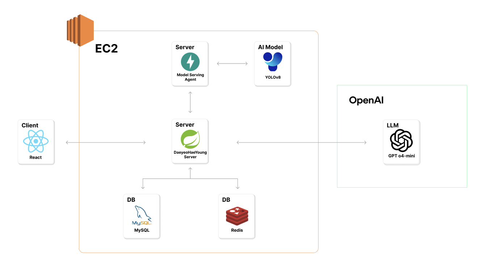
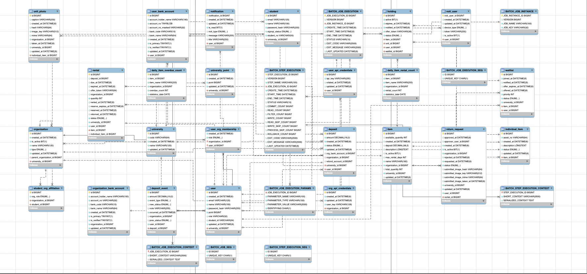

# 대여해영
대학생활 스마트 대여 플랫폼

---

## 📌 목차
- [소개](#-소개)
- [기술 스택](#-기술-스택)
- [프로젝트 구조](#-프로젝트-구조)
- [설치 및 실행 방법](#-설치-및-실행-방법)
- [환경 변수 설정](#-환경-변수-설정)
- [팀원 및 팀 소개](#-팀원-및-팀-소개)
- [기술 스택](#️-기술-스택)
- [주요 기능](#-주요-기능)
- [아키텍처](#-아키텍처)
- [API 문서](#-api-문서)
- [기여 방법](#-기여-방법)

---

## 📖 소개

> 대여해영은 대학교 대여 사업에서 대면 절차를 줄이고, 수기 행정 없이 온라인으로 물품을 대여할 수 있는 스마트 대여 플랫폼입니다.  

---

## 🛠 기술 스택
- **Backend**: Spring Boot, JPA, Spring Batch, Spring Security
- **Frontend**: React
- **Database**: MySQL, Redis
- **Infra**: AWS EC2, S3, Docker
- **Etc**: Swagger, OpenAI API

---

## 📂 프로젝트 구조
```bash
 Backend/
 ├── daeyo-ai/
 ├── daeyo-batch/
 ├── daeyo-common/
 ├── daeyo-domain/
 ├── daeyo-external-api/
 ├── daeyo-infra/
 └── scripts/
````

---

## 🚀 설치 및 실행 방법

### 1. 저장소 클론

```bash
git clone https://github.com/Shinhan-DaeyeohaeYoung/Backend.git

cd Backend
```

### 2. 환경 변수 설정

`.env` 또는 `application.yml` 파일에 환경 변수를 설정합니다.
[환경 변수 설정](#-환경-변수-설정) 참고.

### 3. 실행

```bash
# Backend

## 로컬 서버 실행
./gradlew bootRun

## 도커 컴포즈로 실행
cd scripts
docker-compose up -d
```

---

## ⚙ 환경 변수 설정

예시 `.env`:

```env
AWS_REGION=${AWS_REGION}
AWS_ACCESS_KEY_ID=${AWS_ACCESS_KEY_ID}
AWS_SECRET_ACCESS_KEY=${AWS_SECRET_ACCESS_KEY}
AWS_S3_BUCKET_NAME=${AWS_S3_BUCKET_NAME}

JWT_SECRET=${JWT_SECRET}
JWT_ACCESS_TOKEN_VALIDITY_SECONDS=${JWT_ACCESS_TOKEN_VALIDITY_SECONDS}
JWT_REFRESH_TOKEN_VALIDITY_SECONDS=${JWT_REFRESH_TOKEN_VALIDITY_SECONDS}

CRYPTO_KEY_BASE64=${CRYPTO_KEY_BASE64}

MYSQL_DB=${MYSQL_DB}
MYSQL_USER=${MYSQL_USER}
MYSQL_ROOT_PW=${MYSQL_ROOT_PW}
MYSQL_PW=${MYSQL_PW}
MYSQL_TZ=Asia/Seoul

DB_HOST=${DB_HOST}
DB_PORT=${DB_PORT}
DB_SOURCE=${DB_SOURCE}
DB_USER=${DB_USER}
DB_PASSWORD=${DB_PASSWORD}

REDIS_HOST=${REDIS_HOST}
REDIS_PORT=${REDIS_PORT}

QR_SCHEME=${QR_SCHEME}
QR_SIZE=${QR_SIZE}
QR_SCAN_URL=${QR_SCAN_URL}
QR_JWT_SECRET=${QR_JWT_SECRET}
QR_JWT_DEFAULT_TTL=${QR_JWT_DEFAULT_TTL}

OPENAI_API_KEY=${OPENAI_API_KEY}
OPENAI_BASE_URL=${OPENAI_BASE_URL}

IMAGE_THRESHOLD_AGENT_URL=${IMAGE_THRESHOLD_AGENT_URL}
```
---

## 👏 팀원 및 팀 소개
|                              신승용                               |                           윤규성                            |                          이지혜                          |
|:--------------------------------------------------------------:|:--------------------------------------------------------:|:-----------------------------------------------------:|
|  |  |  |
|                             BE, 팀장                             |                            BE                            |                          BE                           |
|           대여, 예약, 대기열, 알림 도메인 구현, 인프라 구축, 배치 시스템 구축            |           유저, 보증금, 금융망 API, 조직, 학교 포인트 도메인 구현            |            대여, 반납, 물품, Open AI, QR 도메인 구현             |

|                           길태은                            |                            안수진                             |                                              
|:--------------------------------------------------------:|:----------------------------------------------------------:|
|  |  |                                              
|                            FE                            |                             FE                             |                                              
|        관리자 사이드 대여-반납 흐름, PWA 세팅, 전역 상태관리(모달, 사용자)        |            유저 사이드 대여-반납 흐름, 페이지 레이아웃 및 공통 컴포넌트             | 

---

## 🗂️ 기술 스택

## 🛠 기술 스택

### Backend


### Frontend


### Database


### Infra & DevOps


### Tools


---

## ✨ 주요 기능

- 대여/반납 시스템
  - QR 코드 스캔
  - AI 기반 파손율 판단
- 예약 및 대기열 시스템
  - 실시간 대기열 관리
  - 예약 알림
- 보증금 입출금 자동화- SOL 모임통장
  - 관리자 대시보드
  - 실시간 통계 및 보고서
  - 사용자 관리

---

## 🪜 아키텍처



---

## 🔗 ERD



---

## 📑 API 문서

Swagger 문서는 실행 후 아래 URL에서 확인할 수 있습니다.

* [Swagger UI](http://localhost:8082/swagger-ui.html)

---

## 🤝 기여 방법

1. 이슈 생성 또는 할당
2. `feature/브랜치명`으로 작업
3. 작업 완료 후 PR 생성
4. Merge 후 배포

---


